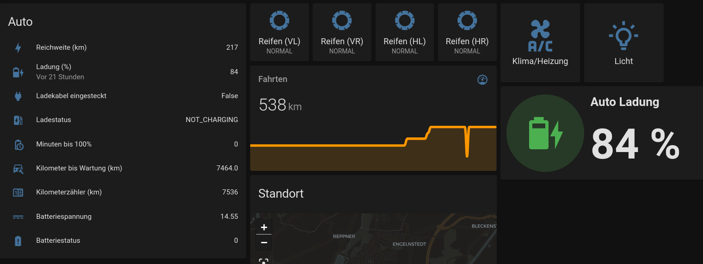
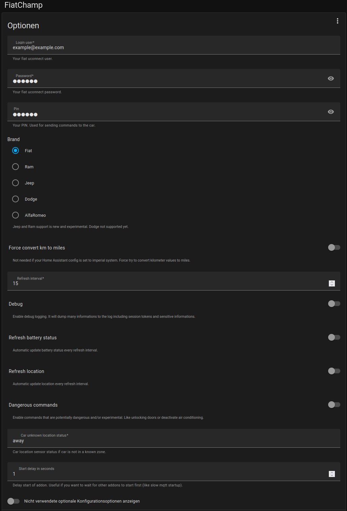
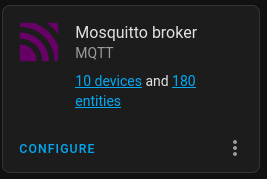
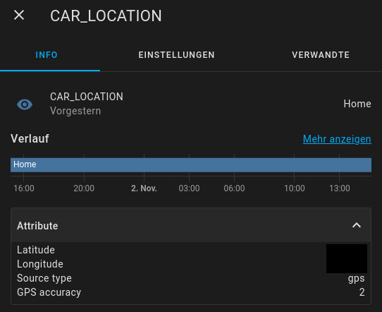

<div align="center" width="100%">
    
</div>

<div align="center" width="100%">
    <h1>FiatChamp</h1>
    <p>Home assistant integration for FIAT, Jeep, Ram, Dodge and Alfa Romeo.</p>
    <a target="_blank" href="https://github.com/wubbl0rz/FiatChamp/stargazers"></a>
    <a target="_blank" href="https://github.com/wubbl0rz/FiatChamp/tags"></a>
    <a target="_blank" href="https://github.com/wubbl0rz/FiatChamp/actions"></a>
    <a target="_blank" href="https://github.com/wubbl0rz/FiatChamp/commits/master"></a>
    <a target="_blank" href="https://github.com/wubbl0rz/FiatChamp/blob/master/LICENSE"></a>
</div>

## **📜 Legend**

1. [🔭 Overview](#🔭-1-overview)
   1. [Car model status](#11-car-model-status)
2. [🧩 Features](#🧩-2-features)
3. [📝 Requirements](#📝-3-requirements)
4. [🚫 Limitations](#🚫-4-limitations)
   1. [What doesn't work (yet)](#41-what-doesnt-work-yet)
   2. [What will never work](#42-what-will-never-work)
5. [🛠️ Installation](#🛠️-5-installation)
   1. [Home Assistant OS or Supervised](#51-home-assistant-os-or-supervised)
   2. [Standalone (NOT RECOMMENDED)](#52-standalone-not-recommended)
6. [🧠 Usage Tips](#🧠-6-usage-tips)
7. [🙋 FAQ](#🙋-7-faq)
   1. [Where is my data stored?](#71-where-is-my-data-stored)
   2. [Why isn't my car's location updated correctly?](#72-why-isnt-my-cars-location-updated-correctly)
   3. [What is `DeepRefresh`? How to update the battery charging level?](#73-what-is-deeprefresh-how-to-update-the-battery-charging-level)

## **🔭 1. Overview**

    ⚠️ I have developed this addon specifically for my Fiat Icon 500e, and it is currently the only car that I am able to test it with. As a work in progress, please expect to encounter a few bugs with other models.

Connect your FIAT, Jeep, Ram, Dodge, Alfa Romeo car or truck to Home Assistant by having a uconnect-enabled vehicle and a valid account.

### **1.1 Car model status**

| Model      | Status          |
| ---------- | --------------- |
| Fiat       | ✅ Works        |
| Jeep       | ✅ Works        |
| Ram        | ⚠️ Experimental |
| Dodge      | ❓ Unknown      |
| Alfa Romeo | ❓ Unknown      |

### Example dashboard using sensors and entities provided by this addon:



## **🧩 2. Features**

- Imports various values such as `battery level`, `tyre pressure`, and `odometer` into Home Assistant.
- Supports `multiple brands` including Fiat, Jeep, Ram, Dodge, and Alfa Romeo.
- Allows for `multiple cars` to be monitored on the same account.
- Enables `location tracking`.
- Supports Home Assistant `zones` such as home, work, etc.
- Utilizes the `same data source as the official app`.
- Enables `remote commands`, including the ability to open doors, switch on the air conditioner, and more. (Note that some commands may not work with all cars.) Available commands include:
  - `UpdateLocation` updates GPS location of the car
  - `RefreshBatteryStatus` refreshes battery level %
  - `DeepRefresh` same as "RefreshBatteryStatus"
  - `Blink` blinks lights
  - `ChargeNOW` starts charging
  - `Trunk` opens/closes trunk lock
  - `DoorLock` opens/closes doors
  - `HVAC` turns on temperature preconditioning in the car
    Note that the `EnableDangerousCommands` option must be used for some commands such as `DoorLock` and `HVAC`.
- Includes an option to `convert kilometers to miles`.

## **📝 3. Requirements**

- For optimal performance, we recommend using the Official Home Assistant MQTT Addon, which can be configured to run either as an internal service or with an external MQTT broker. If you choose to use an external broker, it must be connected to the Home Assistant MQTT integration for seamless communication.

Please note that there are different uconnect services available, so it's important to ensure that your car is compatible with one of the following uconnect sites. Please be aware that older vehicles that only use mopar.com may not be supported.

- `Fiat` https://myuconnect.fiat.com
- `Jeep` https://myuconnect.jeep.com
- `Ram` https://connect.ramtrucks.com
- `Dodge` https://connect.dodge.com
- `Alfa Romeo` https://myalfaconnect.alfaromeo.com

## **🚫 4. Limitations**

### **4.1. What doesn't work (yet)?**

- Eco Reports (statistics). I could not find any API yet. The official app shows it so in theory it should be accessible.

### **4.2. What will never work?**

- While I have been unable to locate an API for Eco Reports (statistics), it should theoretically be accessible since the official app is capable of displaying it.

## **🛠️ 5. Installation**

### **5.1 Home Assistant OS or Supervised**

Follow the official docs: https://www.home-assistant.io/addons/

Summarized version:

- Switch on `Advanced Mode` in your users profile. (if you haven't already)
- Go to `Settings` / `Add-ons` / `ADD-ON STORE`
- Top right `three dots`
  - Add repo
  - https://github.com/wubbl0rz/FiatChamp
- Top right `three dots`
  - Check for updates
- `Refresh Page` <kbd>F5</kbd>
- The store should now display this repository, allowing you to easily install the addon.

### **5.2 Standalone (NOT RECOMMENDED)**

If you're using Home Assistant as a self-managed Docker container (as discussed in issue [#22](https://github.com/wubbl0rz/FiatChamp/issues/22), you can use FiatChamp in standalone mode. However, please note that this process requires updating the container and exporting all the necessary environment variables, and is **recommended only for advanced users**. The supervisor token can be generated on the user profile page within Home Assistant (Long-Lived Access Tokens).

`docker-compose.yml` example:

```yaml
version: "3.9"
services:
  FiatChamp:
    image: ghcr.io/wubbl0rz/image-amd64-fiat-champ:3.0.8
    environment:
      - STANDALONE: True
      - FiatChamp_FiatUser: user@example.com
      - FiatChamp_FiatPw: 123456
      - FiatChamp_FiatPin: 9999
      - FiatChamp_SupervisorToken: eyJhbGciOiJIUzI1NiIsInR5cCI6IkpXVCJ9.eyJpc3MiOiI5NGFmMGJhZTFjYTQ0ODk2YWEzYjgzMGI5YmE4NGQxNiIsImlhdCI6MTY3MDA3Mjc
      - FiatChamp_StartDelaySeconds: 1
      - FiatChamp_Region: Europe
      - FiatChamp_Brand: Fiat
      - FiatChamp_CarUnknownLocation: Unknown
      - FiatChamp_ConvertKmToMiles: False
      - FiatChamp_MqttUser: mqtt
      - FiatChamp_MqttPw: 123456
      - FiatChamp_MqttServer: 192.168.2.132
      - FiatChamp_MqttPort: 1883
```

## **🧠 6. Usage Tips**

- You don't have to configure MQTT. At startup, the addon will automatically connect to your Home Assistant MQTT broker.
- The PIN is only needed if you want to send commands to your car. It's the same PIN used by the official app or website.
- Use `DEBUG` carefully. It will dump many pieces of information to the log, including session tokens and sensitive information.
- Automatic refresh of location and battery level may drain your battery a bit more. The car has to wake up some parts, read new values, and send them back. This will get executed every `Refresh interval` and at every command, even if your car is not at home. **Recommendation**: It's better to use a Home Assistant automation instead. You can set up an automation that is triggered by plugging in the charger cable and then updates the battery level (by calling DeepRefresh) every 15 minutes until it's 100% or the charger is disconnected. ([See here for screenshots of my automations](https://github.com/wubbl0rz/FiatChamp/issues/4#issuecomment-1271866433))
- Only set `Dangerous commands` if you want to use unofficial commands that are not present in the official app.
- MQTT override can be used if you want to utilize an external MQTT broker. **You do not need this if you are using the official Home Assistant MQTT addon.**

<details>
<summary>Screenshot</summary>



</details>

## **🙋 7. FAQ**

### **7.1. Where is my data stored?**

After configuring the MQTT integration in Home Assistant, click on `devices` to find the new entry for your car, which should be named `car` or whatever nickname you assigned on the website. If you don't see it, check the addon's error logs for any issues.

<details>
<summary>Screenshot</summary>



</details>

### **7.2. Why isn't my car's location updated correctly?**

To help you understand the location functionality, you should check the attributes to see if there are any issues. The main status depends on the zones that you have configured in Home Assistant. When your car is within the radius of a predefined zone, the location will show the name of the zone. If the car is outside of a zone's radius, the status will show as `away` or a custom string.

<details>
<summary>Screenshot</summary>



</details>

### **7.3. What is `DeepRefresh`? How to update the battery charging level?**

`DeepRefresh` is the term used for updating the battery status in the Fiat language. The car sends updates on the battery charging level relatively rarely. If that's too slow for you, you can press the `RefreshBatteryStatus` or `DeepRefresh` button (or call it in an automation) to immediately update and send back the current battery charging level.

<details>
<summary>Screenshot</summary>


</details>
